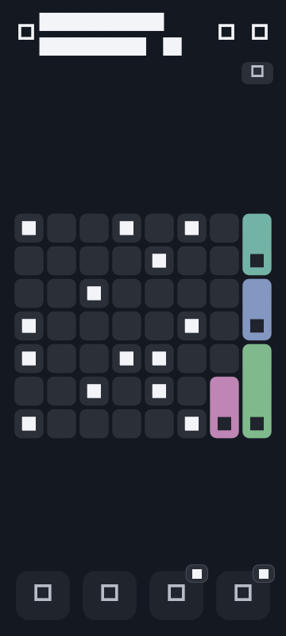
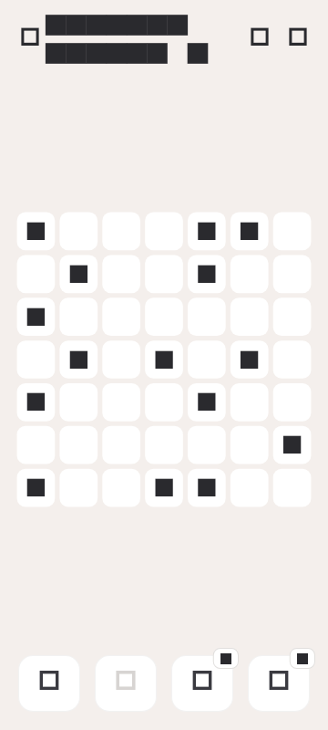

# Shikaku

> Draw rectangles. Trust the numbers. Feel flawless.

A Flutter Shikaku puzzle for mobile (and web). Partition the grid, match every clue to its area, and chase that **Flawless!** screen.

Inspired by a benchmark reference UI — rebuilt from the ground up in Flutter.

## Screenshots

| Dark theme | Light theme |
|:---:|:---:|
|  |  |

## How to play

Shikaku is a logic puzzle. Your job: **tile the whole grid with rectangles**.

1. Every rectangle contains **exactly one number**.
2. That number equals the **area** of the rectangle (how many cells it covers).
3. Rectangles **never overlap**.
4. Every cell must belong to a rectangle.

**Drag** across cells to draw a rectangle. **Tap eraser**, then a rectangle, to remove it. Solve the board and earn a *Flawless!*

> No lazy 1-cell rectangles here — every clue is at least **2**. Think bigger.

## Features

- **Drag-to-draw** rectangles with a live preview while you drag
- **Eraser**, **undo**, **hints** (6 charges), and a **magic wand** (1 charge) for when logic needs a nudge
- **Procedural puzzles** that scale with level — grid size grows as you progress
- **Dark / Light / System** themes with optional haptic feedback
- **Settings sheet** — timer, size counter, reset level
- **Win screen** with mascot, level picker slider, and a satisfying *Flawless!*
- **Progress saved** locally via `shared_preferences`

## Tech stack

- Flutter 3.32 / Dart 3.8
- Android, iOS, and Web
- [`shared_preferences`](https://pub.dev/packages/shared_preferences) for settings persistence

## Project structure

```
lib/
├── models/       # Grid, clues, rectangles
├── logic/        # Puzzle generator + validator
├── state/        # Game + settings controllers
├── ui/           # Screens and widgets
└── theme/        # Palettes and typography

benchmark/        # Reference video, extracted frames, UI spec
test/             # Logic tests + golden renders
```

## Getting started

**Prerequisites:** [Flutter SDK](https://docs.flutter.dev/get-started/install) installed.

```bash
flutter pub get
flutter run
```

| Platform | Command |
|----------|---------|
| Web | `flutter run -d chrome` |
| Android | `flutter run` (device or emulator connected) |
| Windows desktop | `flutter run -d windows` |

## Build APK (Android)

```bash
flutter build apk --release
```

The APK lands at:

```
build/app/outputs/flutter-apk/app-release.apk
```

Install over USB:

```bash
adb install -r build/app/outputs/flutter-apk/app-release.apk
```

## Tests

```bash
flutter analyze
flutter test
```

- **Logic tests** — `test/widget_test.dart` (generator, validator, no 1-cell rectangles)
- **Golden renders** — `test/render_golden_test.dart` (UI snapshots at benchmark resolution)

## Benchmark reference

The UI/UX was reverse-engineered from a reference video:

- Video: [`benchmark/shikaku-benchmark.mp4`](benchmark/shikaku-benchmark.mp4)
- Extracted frames: `benchmark/frames/`
- Design spec: [`benchmark/SPEC.md`](benchmark/SPEC.md)

## License

TBD

---

Built with Flutter.
